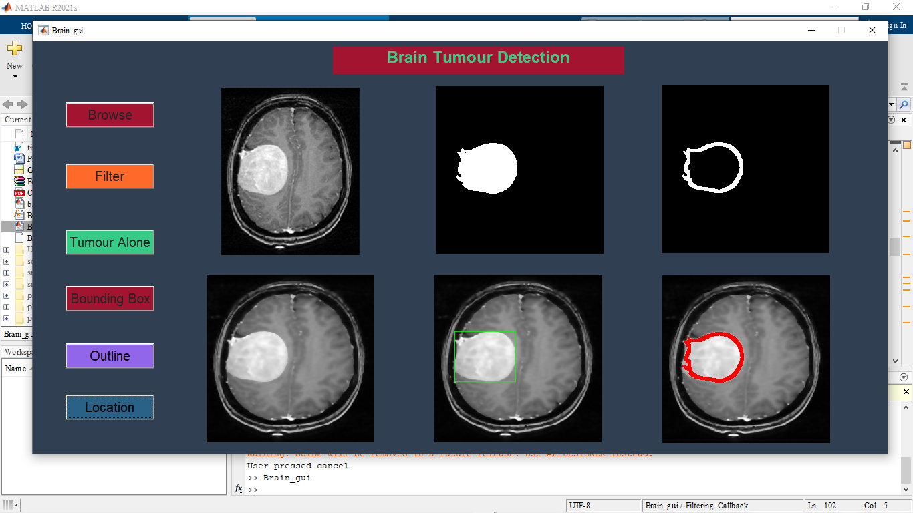

# Brain-tumour-detection

Brain tumour detection from MRI images using Image processing with a Gui in Matlab.User has to select MRI Image of brain,if there any tumour is present it will detect and give a outline of the Tumour.

## Screenshots

  
